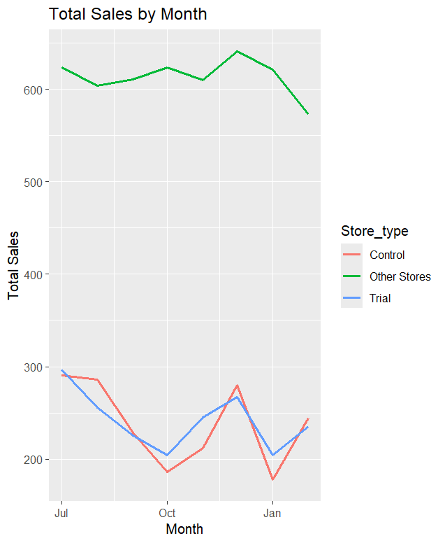
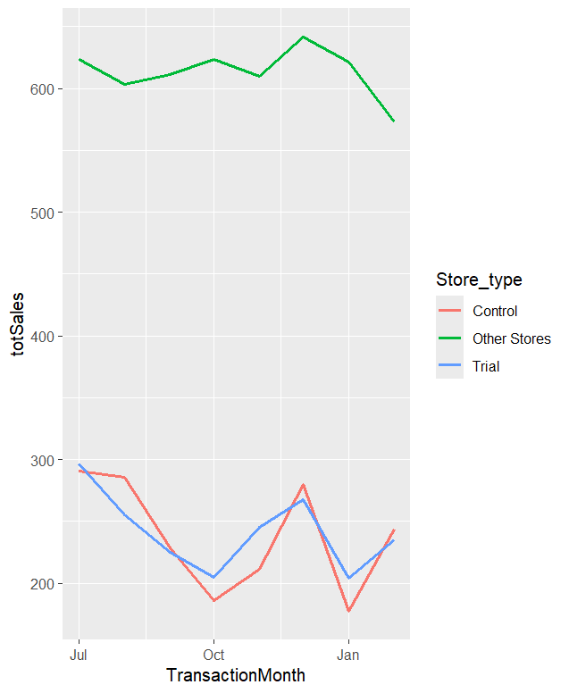
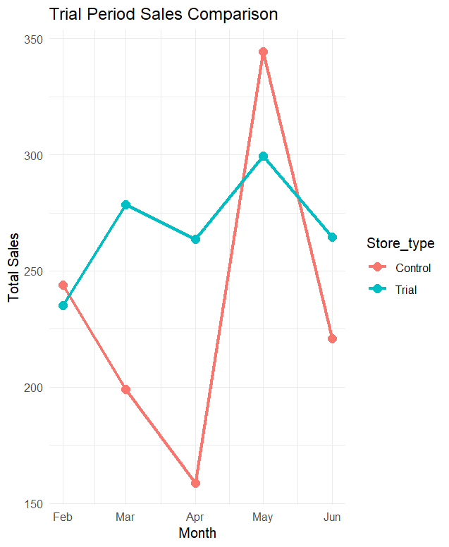
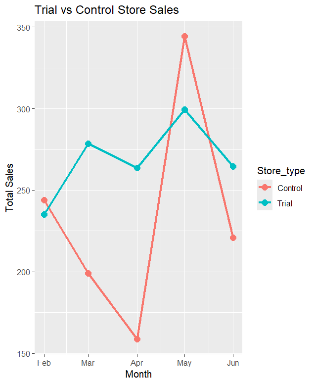

# Quantium Virtual Internship – Task 2: Experimentation & Uplift Testing

## 📌 Project Overview

This project is part of the Quantium Data Analytics Virtual Job Simulation on Forage. The objective was to evaluate the effectiveness of a retail store trial by comparing the performance of trial stores with carefully selected control stores. The analysis was performed using R and statistical techniques to measure sales uplift and identify whether the trial had a significant business impact.

---

##  Dataset

The project uses the Quantium retail transaction dataset provided during the virtual internship.

**Dataset includes:**

- Customer transaction records
- Store information
- Monthly sales
- Number of customers
- Product purchases
- Trial and control store data

---

## 🎯 Objectives

- Select appropriate control stores for comparison.
- Compare trial store performance before and during the trial.
- Analyze sales growth and customer count.
- Measure uplift generated during the trial period.
- Validate results using statistical significance testing.
- Present business insights through visualizations.

---

## 🛠 Tools Used

- R Programming
- dplyr
- ggplot2
- tidyverse
- readxl
- data.table

---

## 📊 Methodology

1. Imported and cleaned retail transaction data.
2. Aggregated monthly sales and customer metrics.
3. Selected suitable control stores using correlation and magnitude distance.
4. Compared trial and control store performance.
5. Calculated sales uplift during the trial period.
6. Performed statistical significance testing.
7. Created visualizations to communicate findings.

---

## 📈 Results

- Successfully identified suitable control stores.
- Trial stores showed improved sales during the trial period.
- Customer transactions increased compared to the control stores.
- Statistical analysis was used to determine whether the uplift was significant.
- Business recommendations were prepared based on the findings.

---

## 📷 Screenshots

### Total Sales by Month

---

### Transactions by Month

---

### Trial Period Sales Comparison

---

### Trial vs Control Store Sales

---

##  Skills Demonstrated

- Data Analytics
- R Programming
- Retail Analytics
- Experimentation
- Statistical Testing
- Data Visualization
- Customer Analytics
- Business Insights
- Data Cleaning
- Exploratory Data Analysis (EDA)

---

## 📄 Report

The complete project report is available in:

**Task 2 Experimentation and uplift testing.pdf**

---

## 🎓 Acknowledgement

This project was completed as part of the **Quantium Data Analytics Virtual Job Simulation** offered by **Forage**. It demonstrates practical experience in retail analytics, experimentation, statistical testing, and business decision-making using real-world datasets.
